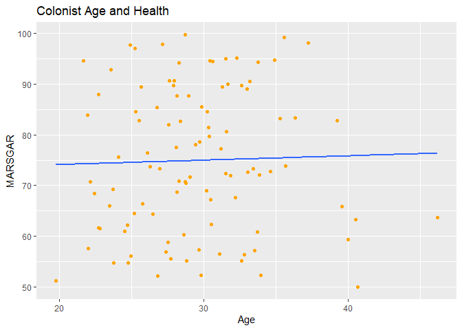
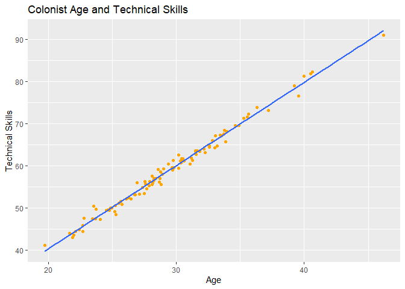
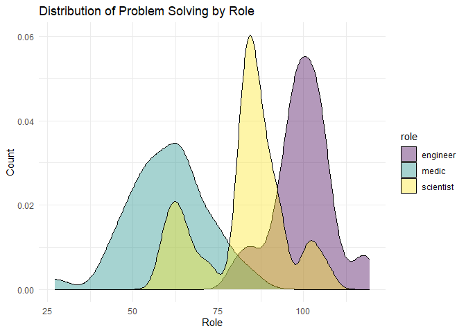

Lab 13 - Colonizing Mars
================
Kryschelle Fakir
3/16/2026

### Load packages and data

``` r
library(tidyverse)
library(tidyverse) 

if (!require("ggplot2")) install.packages("ggplot2")
library(ggplot2)

if (!require("MASS")) install.packages("MASS")
library(MASS)

if (!require("tidyverse")) install.packages("tidyverse")
```

### Exercise 1

``` r
set.seed(123)

age <- rnorm(100, mean = 30, sd = 5)

df_colonists <- data.frame(
  id = 1:100, 
  age = age <- rnorm(100, mean = 30, sd = 5)
) 

roleD <- sample(c("engineer", "scientist", "medic"),
    replace = TRUE, 
    size = 100, prob = c(1,1,1)
)

set.seed(123)

df_colonists$marsgar <- runif(100, min = 50, max = 100)

ggplot(df_colonists, aes(x = age, y = marsgar)) + 
  geom_point(colour = "orange") +
  geom_smooth(method = "lm", se = FALSE) +
  labs(
    title = "Colonist Age and Health",
    x = "Age",
    y = "MARSGAR"
  )
```

    ## `geom_smooth()` using formula = 'y ~ x'

<!-- -->

1.2: The age distribution is normal, but there is more or less skew
depending on the seed. For example, seed 123 is more negatively skewed,
whereas seed 100 is more positively skewed. Seed 1000 is normally
distributed though.

1.3: I figured that all three roles are equally important and one should
be as likely as the other but, realistically, they may get more people
in one profession than another. Medics may want to live on mars more or
less than a scientist. Randomness was my goal and, as such, I figured
that randomly drawn roles with equal probability was the best option. I
can see a world where getting an exact number of professionals is
difficult. I think it would be fun to simulate this randomness to just
see what happens.

### Exercise 2

``` r
set.seed(1235)

df_colonists$technical_skills <- 2 * df_colonists$age + rnorm(100, mean = 0, sd = 1)

ggplot(df_colonists, aes(x = age, y = technical_skills)) + 
  geom_point(colour = "orange") +
  geom_smooth(method = "lm", se = FALSE) +
  labs(
    title = "Colonist Age and Technical Skills",
    x = "Age",
    y = "Technical Skills"
  )
```

    ## `geom_smooth()` using formula = 'y ~ x'

<!-- -->

``` r
set.seed(1235)

df_colonists$role <- sample(c("engineer", "scientist", "medic"),
    replace = TRUE, 
    size = 100, prob = c(1,1,1)
)

df_colonists$problem_solving[df_colonists$role == "engineer"] <- rnorm(sum(df_colonists$role == "engineer"), mean = 100, sd = 10)

df_colonists$problem_solving[df_colonists$role == "scientist"] <- rnorm(sum(df_colonists$role == "scientist"), mean = 80, sd = 10)

df_colonists$problem_solving[df_colonists$role == "medic"] <- rnorm(sum(df_colonists$role == "medic"), mean = 60, sd = 10)

ggplot(df_colonists, aes(x = problem_solving, fill = role)) +
  geom_density(alpha = .4) +
  labs(title = "Distribution of Problem Solving by Role", x = "Role", y = "Count") +
  scale_fill_viridis_d() + 
  theme_minimal()
```

<!-- --> …

Add exercise headings as needed.
